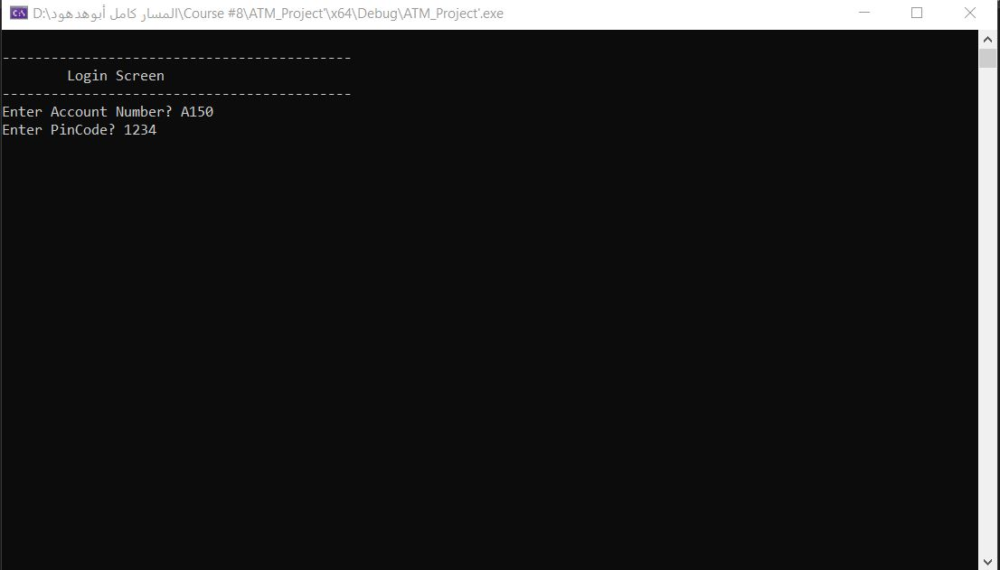
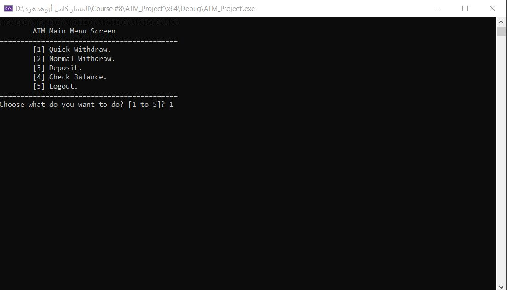
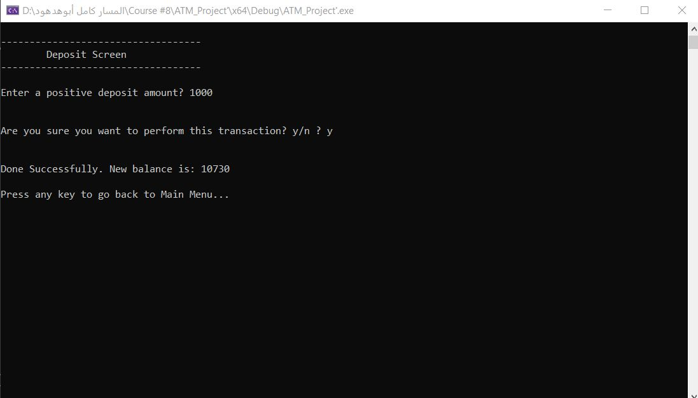
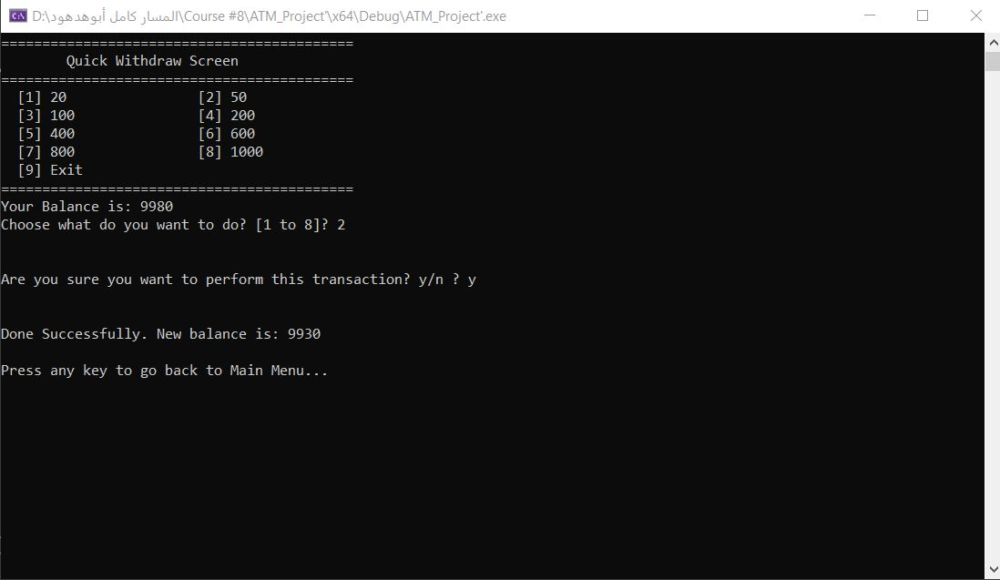
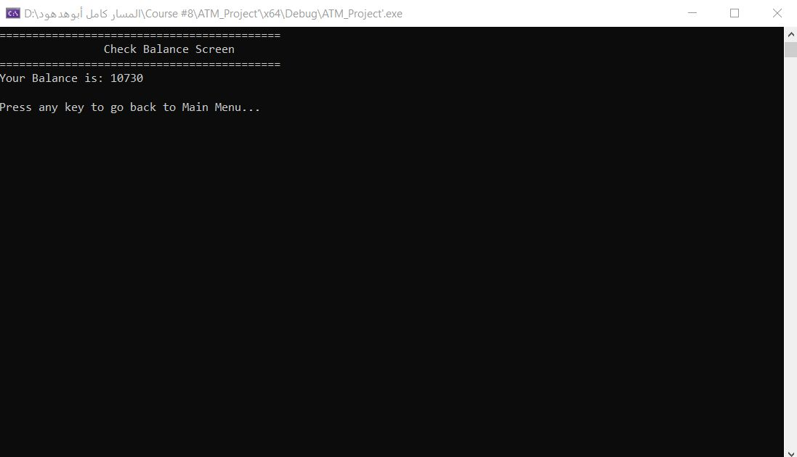

# ATM Simulation System

A console-based ATM Simulation System developed using C++.

The project simulates the core functionalities of an ATM machine, including authentication, withdrawals, deposits, balance inquiries, and persistent file-based storage.

---

## Features

### Authentication

- Login using Account Number and PIN Code
- Validate user credentials from a text file
- Prevent unauthorized access

### Banking Operations

- Quick Withdraw with predefined amounts
- Normal Withdraw with custom amounts
- Deposit money
- Check account balance

### Persistent Storage

- Store client data using text files
- Update balances after transactions
- Preserve data across application runs

---

## Technologies

- C++
- Procedural Programming
- File I/O
- Console Applications

---

## Concepts Practiced

- File Handling
- Authentication Logic
- Transaction Processing
- State Management
- Data Parsing
- Structured Programming

---

## Screenshots

### Login Screen

---

### Main Menu

---

### Deposit

---

### Quick Withdraw

---

### Balance Inquiry

---

## Future Improvements

- Refactor to Object-Oriented Design
- Replace text files with SQL database
- Develop REST APIs using ASP.NET Core
- Add password hashing and encryption

---

## Author

Ali Waheed Aboul-Seoud

Backend Engineer passionate about Computer Science and building reliable software systems using C++ and C#.

- LinkedIn: https://www.linkedin.com/in/ali-waheed-aboul-seoud-a36399336
- GitHub: https://github.com/aliaboulseoud1-sudo
